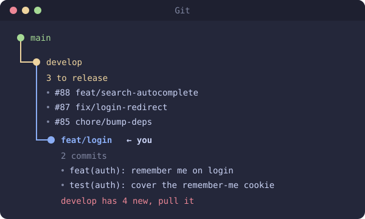

# branch-status

Your branch, your other open branches, `develop` and `main`, drawn as a tiny git-flow graph with each branch's commits.

```
/plugin install branch-status@spardutti-mods
```

## Why

With git flow, features go into `develop`, and `develop` goes into `main` on release.
You keep asking the same three questions. What's waiting to ship? Is my branch behind?
Did that release land? Each one means leaving the chat to run `git log`. This panel answers
all three at a glance.



## How to read it

| You see | It means |
| --- | --- |
| **3 to release** under `develop` | Three merges on `develop` that `main` doesn't have yet. They're listed right under it. |
| **2 commits** under a branch | What that branch adds on top of `develop`, newest first, up to 5. |
| A **purple** branch | Another open branch of yours, with its own commits. |
| **merged into develop** | Your branch's PR merged. Switch to `develop` and pull. |
| **← you** | The branch you're on. |
| A **red line** | Something's behind. Pull, or merge `main` back into `develop`. |
| **all released** | `develop` and `main` match. Nothing waiting. |

## How it works

- **It opens by itself.** The panel opens on the next session start, or right away with `/branch-status`.
- **Merge commits that carry no code are ignored.** After a release, `main` doesn't look "1 ahead" just because of the merge itself.
- **Other branches come from `origin`.** A stale local `main` won't fool it. It's as fresh as your last `git fetch` or `git pull`.
- **Old branches stay out.** A branch only shows if it has work that isn't in `develop` or `main` yet, even after a squash merge. Branches deleted on GitHub are skipped.
- **Nothing gets cut off.** Long branch and PR names wrap instead.
- **It keeps itself up to date.** It refreshes on start, after any `git` or `gh` command, and every 30 seconds.

`main` and `develop` are fixed names for now.

## Put the panel beside the chat

Out of the box, the panel sits above the chat. Switch Claude Code to fullscreen view and it
docks on the right, which is how it's meant to be used:

```
/tui fullscreen
```

It's saved for every new session. Fullscreen needs a terminal at least 110 columns wide.
Changed your mind? `/tui default` takes you back.

Too wide or too narrow? Drag the panel's edge. Claude Code remembers the size.

### Fullscreen troubleshooting

- **Scrolling feels slow.** Run `/scroll-speed` and pick a bigger number.
- **Old text stays on screen (Windows Terminal, WSL).** Start Claude with
  `CLAUDE_CODE_ALT_SCREEN_FULL_REPAINT=1 claude`.
- **A session you already had open didn't change.** Open sessions keep their view.
  Run `/tui fullscreen` in each one.
- **Using herdr and the panel won't dock.** Update herdr to 0.9.3 or newer, then run
  `herdr integration install claude`.

[← All mods](../../README.md)
